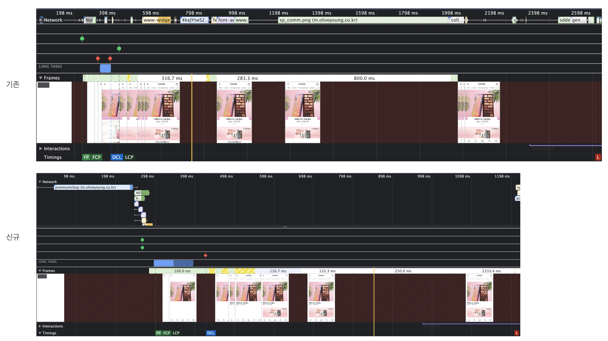

# Go 설치부터 VS code에서 작업하기

## 환경

* Ubuntu 18.04
* Go 1.13.4

## Go 설치

1. Go 다운로드 [https://golang.org/dl/](https://golang.org/dl/)&#x20;
2.  설치 가이드 문서 참고하기 [https://golang.org/doc/install#tarball](https://golang.org/doc/install#tarball)\
    PATH의 경우 \~/.profile에 추가해놓을 수 있음

    ```
    $ sudo tar -C /usr/local -xzf go1.13.4.linux-amd64.tar.gz
    $ export PATH=$PATH:/usr/local/go/bin
    $ go version
    $ go env
    ```
3. GOROOT와 GOPATH 설정
   * GOROOT \
     Go가 설치된 공간
   * GOPATH [https://golang.org/doc/code.html#GOPATH](https://golang.org/doc/code.html#GOPATH)\
     작업 공간을 가리키는 환경변수
   * go env 명령어로 설정을 확인해볼 수 있음

## VS code에서 Go 작업하기

1. Go 소스 디렉토리 기본 구조[ https://golang.org/doc/code.html#Workspaces](https://golang.org/doc/code.html#Workspaces)
   * src
   * bin
   * pkg
2. VS code에서 Go extension 설치
3. extension 설치 후 미설치된 Tool을 VS code의 도움을 받아 설치 [참고](http://golang.site/go/article/203-VS-Code%EC%97%90%EC%84%9C-Go-%EC%82%AC%EC%9A%A9)
4. 아래와 같이 테스트&#x20;




## 참고



{% embed url="http://golang.site/go/article/2-Go-%EC%84%A4%EC%B9%98%EC%99%80-Go-%ED%8E%B8%EC%A7%91%EA%B8%B0-%EC%86%8C%EA%B0%9C" %}

{% embed url="http://golang.site/go/article/203-VS-Code%EC%97%90%EC%84%9C-Go-%EC%82%AC%EC%9A%A9" %}

