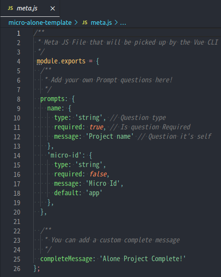
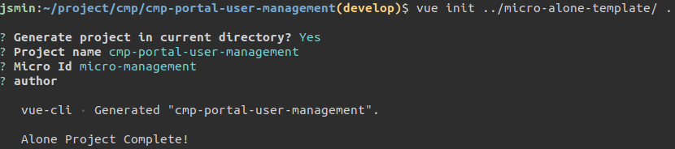

# Vue 템플릿으로 프로젝트 만들어보기

Container에 올릴 또다른 Micro Frontend 프로젝트를 구성할 때

매번 비슷한 설정을 해주는 과정을 줄일 수 있는 템플릿을 만들어보자!

Micro Frontend 프로젝트를 새로 구성할 때 기본으로 아래 설정들이 필요하다.

* vue-cli로 시작
* 공통 라이브러리, 컴포넌트, 로그인 등 넣어주기
* babel, prettier, eslint 등 설정해주기
* .env 파일 만들어주기
* 등등.........

이런 설정들을 미리 템플릿으로 만들어놓고 프로젝트 생성할 때 바로 바로 쓸 수 있게 해본다.

#### 재사용할 수 있는 템플릿 만들어보기

템플릿 프로젝트는 다음과 같다.

* template 디렉토리 재사용할 코드, 파일 등이 들어있다.
* meta.js Vue cli로 전달받을 정보들을 선언해놓는다.

meta.js에 cli로 전달받은 정보들을 소스코드에도 넣을 수 있다.

#### vue init으로 템플릿을 활용해 프로젝트 생성하기

예시\) 현재 디렉토리에 템플릿으로 프로젝트를 만든다.

그리고 npm install / npm run serve로 실행해본다.

#### 참고

* [https://medium.com/@joshvillahermosa/how-to-create-a-simple-re-usable-vue-project-template-9ec48c6ce0a2](https://medium.com/@joshvillahermosa/how-to-create-a-simple-re-usable-vue-project-template-9ec48c6ce0a2)

